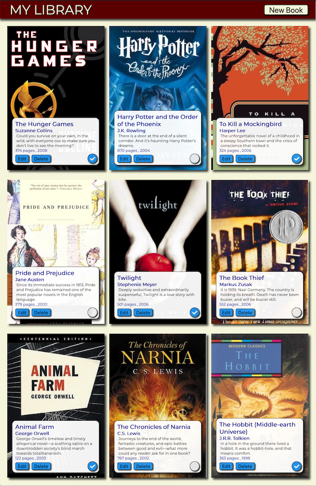

# Project: My Library

This project is a refactor of my [original](https://github.com/winplam/library) plain vanilla JavaScript "My Library" project to use the ReactJS framework.
Converting from regular JS DOM manipulation methods to the React framework is in a theory a straightforward process.
A goal of the conversion was to keep all the functionality of the original project.
Using React, it's apparent how much simpler and more productive using JSX is over manually creating HTML using plan JavaScript.
However, using the HTML DOM createDocumentFragment() method did give some of the benefit of easy DOM creation from within JS code.

### [Visit My Library (React Version)](https://winplam.github.io/library-react-version/)

## Project Reflections
This project was small enough for me to take the top down approach in deciding how to break up the React components into smaller pieces.
The most difficulty part was getting the CSS checkbox to become synchronized between the 3 locations where it's found.
I thought it would save time to use icons make from CSS but in actuality, it would have been easier to use a regular image or even a material icon.

I've used functions for the React components in most cases, only converting them to more featured classes as necessary to keep down on any blot.
Props were used where possible over state to keep code easier to manage and have fewer sources of bugs.  

One thing that I couldn't get perfectly like the original was was the width calculation for creating phantom elements used to fill the last line of the Flexbox.
Looking back, it may have been better to use Grid layout for this project due to the workaround that is needed for the last row.

## Screenshot

## Technologies Used
This page was made with React JS, JavaScript, HTML 5 and CSS 3 using Webstorm for the IDE. 

[Assignment Page](https://www.theodinproject.com/courses/javascript/lessons/library) 
